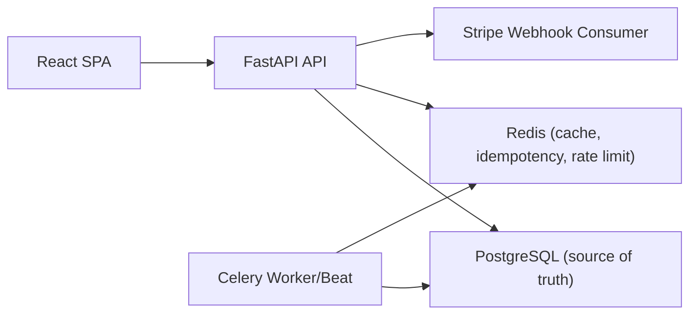

# Big Apple Cinemas

Production-grade movie ticketing platform built with FastAPI + React.

## What Is Implemented

- Catalog browsing with theater/date filters and showtime seat inventory.
- Transaction-safe seat holds with expiry and release.
- Checkout flow with `MOCK_STRIPE` plus Stripe Checkout-ready webhook handling.
- Auth with access + refresh token rotation (`/auth/login`, `/auth/refresh`, `/auth/logout`).
- Ticket QR display, copy/share/download, and scanner page (manual + camera mode where supported).
- Personalized recommendations with feedback (save/hide), event tracking (impression/click), and admin KPI snapshot.
- Structured request IDs, rate limits, and Prometheus-style metrics endpoint.

## Demo Walkthrough

`Book -> Hold -> Checkout -> Ticket -> Scan`

1. Sign in with demo admin credentials.
2. Open `/movies`, pick a showtime, and select seats.
3. Start a hold and verify countdown/hold state.
4. Complete checkout (demo confirm or hosted Stripe redirect when configured).
5. Open `/me/tickets` to view QR and order history.
6. Open `/scan`, scan or paste token, and verify one-time entry behavior.

Ticket lifecycle rule:
- Ticket is considered active for entry until `showtime.ends_at + TICKET_ACTIVE_GRACE_MINUTES` (default 20).
- After that window, scanner returns expired and My Tickets moves it to past.

## Monorepo Layout

- `apps/backend`: FastAPI API, SQLAlchemy models, Alembic, workers
- `apps/frontend`: React app (Vite + Router + TanStack Query)
- `.github/workflows`: CI/CD workflows
- `infra/`: infra stubs for NGINX/Prometheus/Grafana
- `docs/`: architecture, concurrency, payments, deployment notes
- `docs/api.md`: current API endpoint reference
- `docs/environment.md`: runtime environment variables and deploy secrets checklist
- `docs/ux-design-brief.md`: UX strategy and deliverables for upcoming development
- `docs/phase-2-plan.md`: scheduled Phase 2 execution plan and git checkpoints
- `docs/phase-3-plan.md`: seat map + showtime seat inventory implementation schedule
- `docs/phase-4-plan.md`: concurrency-safe reservation hold implementation plan
- `docs/phase-5-plan.md`: checkout and webhook-based payment finalization plan
- `docs/phase-6-plan.md`: ticket validation, user portal, and admin sales snapshot plan
- `docs/phase-7-plan.md`: production hardening with rate limits and request correlation

## Architecture Snapshot



## Local Development

```bash
docker compose up --build
```

Services:

- Frontend: `http://localhost:5173`
- Backend API: `http://localhost:8000`
- Health: `http://localhost:8000/health`
- Metrics: `http://localhost:8000/metrics`
- Celery beat runs reservation expiry and daily recommendation similarity rebuild jobs
- Optional real checkout provider in frontend: `VITE_CHECKOUT_PROVIDER=STRIPE_CHECKOUT`

Demo admin login (local bootstrap):

- Email: `demo@bigapplecinemas.local`
- Password: `DemoAdmin123!`

## CI/CD

- CI: `.github/workflows/ci.yml` runs backend (`ruff`, `pytest`) and frontend (`eslint`, `vitest`).
- Deploy: `.github/workflows/deploy.yml` includes staging/prod jobs with migration-first order and environment-gated secrets.
- Secrets and runtime env checklist: `docs/environment.md`.

## Packaging Checklist

- Capture screenshots/GIFs for (to be done):
  - Home hero + recommendations
  - Seat hold countdown + checkout processing
  - My Tickets QR + scanner success/already-used/expired states
  - Admin dashboard KPIs
- Keep diagrams in:
  - `docs/architecture.md`
  - `docs/concurrency.md`
  - `docs/payments.md`

## Git Workflow (Strict)

- Milestone baseline commit lands on `main`.
- Feature branch commits are merged to `main` after review.
- Push after each milestone/merge checkpoint.
