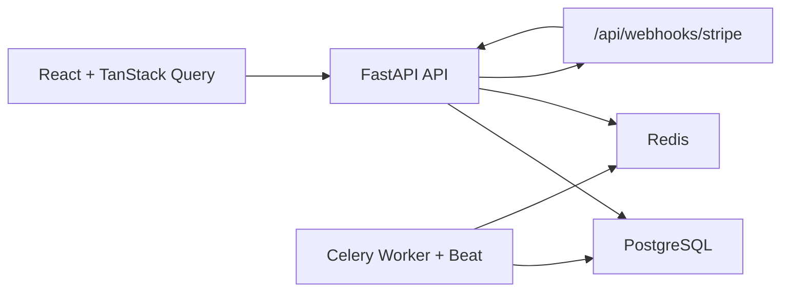

# Architecture

## High-level

- React SPA consumes FastAPI REST endpoints.
- PostgreSQL is the system of record.
- Redis is used for cache, ephemeral holds, and queue broker.
- Celery workers handle expiration/email jobs.

## Service Boundaries

- `apps/backend/app/api`: HTTP interface and request validation.
- `apps/backend/app/services`: transactional business logic.
- `apps/backend/app/models`: persistence model.
- `apps/frontend/src/pages`: user and admin surfaces.

## Main Runtime Flows

1. Auth:
   - Login/register return access + refresh tokens.
   - Refresh token rotation is persisted in `refresh_token_sessions`.
2. Reservation:
   - Hold seats with row locks on `showtime_seat_status`.
   - Expire via beat job and reservation endpoints.
3. Checkout:
   - Create pending order from active reservation.
   - Finalize paid order from webhook or demo confirm.
4. Tickets:
   - QR token rendered in My Tickets.
   - Scanner marks valid ticket as used atomically.
   - Entry validity window respects showtime end + grace.
5. Recommendations:
   - Candidate ranker blends personalized similarity, popularity, freshness.
   - User feedback and interaction events feed admin KPIs.

## Catalog Caching

- Read-heavy catalog endpoints (`/movies`, `/movies/{id}`, `/theaters`, `/showtimes`) are cached in Redis.
- Cache keys use the `catalog:*` prefix and include query parameters for deterministic lookups.
- Admin catalog writes invalidate `catalog:*` key groups to keep read responses fresh.

## Seat Inventory Foundation

- Local bootstrap seeds a default auditorium seat map (8 rows x 12 seats) and seat rows if missing.
- Each showtime is synchronized with `showtime_seat_status` rows so seat availability is showtime-specific.
- `GET /api/showtimes/{showtime_id}/seats` joins showtime + seat inventory for seat map rendering.
