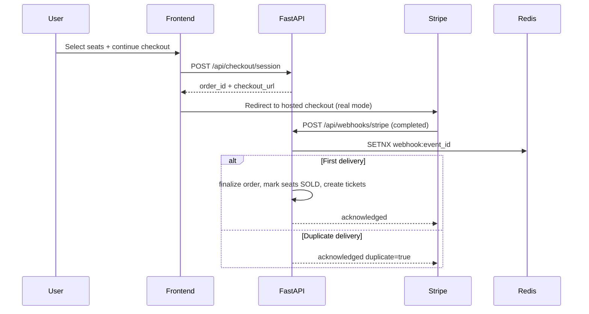

# Payments

## Provider

- `MOCK_STRIPE` for local/demo flow.
- `STRIPE_CHECKOUT` for hosted Stripe checkout session flow.
- Provider is selected at checkout request level and can be defaulted in frontend with `VITE_CHECKOUT_PROVIDER`.

## Safety rules

- Price is calculated server-side from seat type + rules.
- Client never controls final amount.
- Webhook is verified either by Stripe signature (`stripe-signature`) or local fallback secret (`x-webhook-secret`).
- Webhook event IDs are stored in Redis with TTL for idempotency.
- Duplicate events are acknowledged but ignored.

## Finalization sequence

1. Receive `checkout.session.completed` webhook.
2. Verify webhook secret and idempotency event key.
3. In one transaction, convert held seats to sold and issue tickets.

## Current Endpoints

- `POST /api/checkout/session`
- `GET /api/checkout/orders/{order_id}`
- `POST /api/checkout/demo/confirm` (local demo)
- `POST /api/webhooks/stripe`
